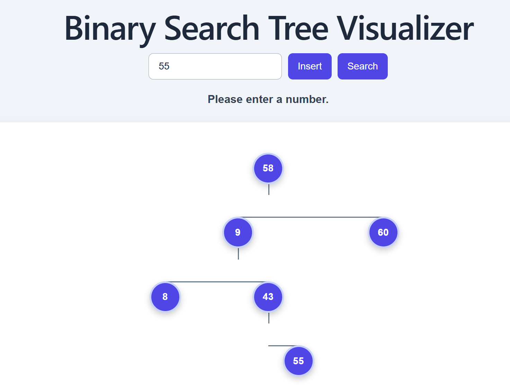

# Binary Search Tree (React + Vite)

A small React app built with Vite that implements and visualizes a Binary Search Tree. This repository demonstrates a simple interactive tree component and the underlying BST logic in plain JavaScript.

**Why this matters:** This project is a clear, focused example of data-structure implementation in a modern frontend stack. It is useful for interviews, teaching, and showcasing algorithm + UI integration on GitHub.

**Screenshot:**


**Tech stack:**
- React
- Vite
- JavaScript (ESM)

**Run locally:**
```bash
npm install
npm run dev
```

Open the dev URL printed by Vite (usually http://localhost:5173) to view the app.

**Key files**
- **App entry:** [index.html](index.html)
- **Vite config:** [vite.config.js](vite.config.js)
- **Project manifest:** [package.json](package.json)
- **BST implementation:** [src/BinarySearchTree.js](src/BinarySearchTree.js)
- **Tree UI component:** [src/Tree.jsx](src/Tree.jsx)
- **Main app component:** [src/App.jsx](src/App.jsx)
- **App bootstrap:** [src/main.jsx](src/main.jsx)
- **Styles:** [src/App.css](src/App.css), [src/index.css](src/index.css)
- **Public assets:** [public/favicon.svg](public/favicon.svg), [public/icons.svg](public/icons.svg)
- **Images & icons:** [binary.png](binary.png), [src/assets/hero.png](src/assets/hero.png), [src/assets/react.svg](src/assets/react.svg), [src/assets/vite.svg](src/assets/vite.svg)

Full repository files (for quick reference):
- [vite.config.js](vite.config.js)
- [index.html](index.html)
- [eslint.config.js](eslint.config.js)
- [desktop.ini](desktop.ini)
- [binary.png](binary.png)
- [.gitignore](.gitignore)
- [package-lock.json](package-lock.json)
- [package.json](package.json)
- [README.md](README.md)
- [src/App.css](src/App.css)
- [src/App.jsx](src/App.jsx)
- [src/Tree.jsx](src/Tree.jsx)
- [src/main.jsx](src/main.jsx)
- [src/index.css](src/index.css)
- [src/BinarySearchTree.js](src/BinarySearchTree.js)
- [public/icons.svg](public/icons.svg)
- [public/favicon.svg](public/favicon.svg)
- [src/assets/vite.svg](src/assets/vite.svg)
- [src/assets/react.svg](src/assets/react.svg)
- [src/assets/hero.png](src/assets/hero.png)

**How this helps on GitHub / for reviewers**
- Clear purpose and runnable instructions make the repository approachable to contributors and employers.
- Highlighted key files guide reviewers to the implementation (`src/BinarySearchTree.js`) and the UI (`src/Tree.jsx`).

**Contributing**
- Feel free to open issues or create PRs. Suggested improvements: add unit tests for BST methods, add animations for insert/delete, add TypeScript types.

**License**
- Choose an appropriate license (e.g., MIT) and add a `LICENSE` file if you plan to publish this as open source.

---
If you'd like, I can also:
- add a short `CONTRIBUTING.md` with contribution guidelines
- add unit tests for `src/BinarySearchTree.js`
- create a small demo GIF for the README

Tell me which of these you'd like next.
